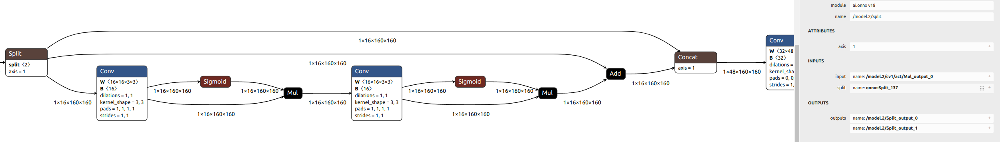

Issue #2.1: Incomplete specification of SPLIT operator

    CAT: Operator
    CRIT: High
    REQ: (TBC)
    LOC: https://onnx.ai/onnx/operators/onnx__Split.html

Issue

    The "axis" attribute gives an integer to define the axis along which split the input tensor into a list of tensors. The onnx documentation does not specify the correspondance between the integer and the axis of the tensor. Is the following interpretation the correct representation ? :

    axis = '0' <=> batch ?
    axis = '1' <=> channels ?
    axis = '2' <=> rows ?
    axis = '3' <=> columns ?

    SB: As discussed yesterday, the specification of the split operator should be free of any semantics. Its input tensor can be of any dimensionality, i.e., it is not possible to attribute the values of axis with a specific meaning.

    Moreover, the "split" input gives a tensor which indicate the length of the 'axis' specified for each output tensor. For example, if the shape of the input tensor is [1,32,320,320] (assuming 32=channels, 320=lines and 320=columns) and the "split" input is [16,16] with the "axis" attribute = 1, then the operator splits the input tensor into two output tensors [1,16,320,320] and [1,16,320,320]. In general, the next layer of the network applies its operation on one of the two output tensors and the other one is kept for use in a deeper layer of the network. But the documentation does not specify which 16 channels are used in the next layer and which 16 channels are set aside. Is it the first 16 or the last 16 channels of the input tensor ?

    SB: I do not think that this issue is real. The split operator has a list of outputs in a specified, fixed order. 
    It is not explicitly mentioned in the documentation but I think it is natural to assume that the output tensors correspond to the individual splits in the corresponding order.

Consequence

    When implementing a neural network containing a "split" operator, the split operation on an input tensor can be performed on the wrong axis et so it would give an incorrect result.
    After the split of tensor's channels, the next layer of the neural network could receive the wrong feature maps and not those expected from the correct channels.

Proposal
Define in the documentation a dictionary associating integers with axis of tensors. The onnx description should specify exactly how the axis of the input tensor is splited and indicate precisely where each of the outputs in the following layers of the network are used.